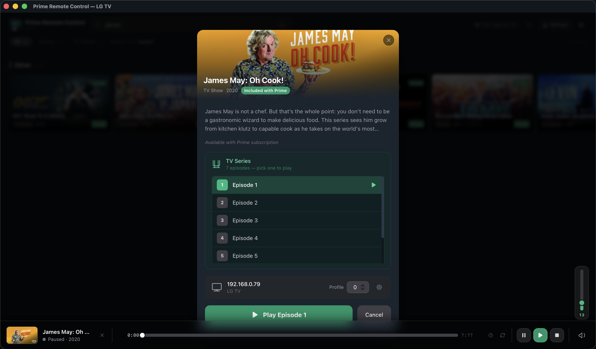

# Prime Remote Control

A Mac app for browsing Prime Video and sending what you want to watch straight to your LG TV — with a remote control built in.

## What it does

Browse Prime Video collections on your Mac, search for titles, and play them on your TV with one click. For TV shows, pick the episode you want. While something is playing, use the on-screen remote to pause, skip, adjust volume, and more.

By default, the catalog shows titles included with your Prime subscription. You can turn on channel add-ons and rent/buy titles in Settings if you want them.

## Screenshots

**Browse your Prime catalog**


**Pick a title and send it to your TV**



## Getting started

1. Open the app settings and enter your LG TV’s IP address.
2. Browse or search for something to watch.
3. Click a title, then hit Play.

To launch the app:

```bash
./launch.sh
```